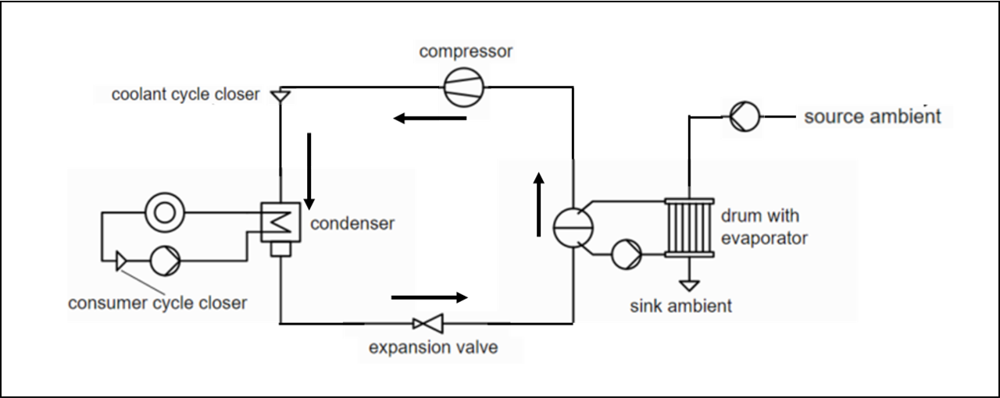

mosaik-heatpump
===============

This package contains adapters to connect to *mosaik*:

1) A heat pump model, based on the `TESPy <https://github.com/oemof/tespy>`_ library.
2) A hot water tank model
3) A controller model

.. contents:: Table of Contents
   :depth: 3

Installation & Tests
--------------------

You can install mosaik-heatpump with pip:

.. code-block:: bash

      pip install mosaik-heatpump

You can run the tests with:

.. code-block:: bash

      pytest

Heat Pump Model
---------------

TESPy
^^^^^
TESPy (Thermal Engineering Systems in Python) provides a powerful simulation package for thermal processes 
like power plants, district heating systems, heat pumps etc. For more information about the library, we 
refer to its `documentation <https://tespy.readthedocs.io/en/master/>`_. The heat pump model provided in this package is based on the model used in TESPy's 
`heat pump tutorial <https://tespy.readthedocs.io/en/master/tutorials_examples.html#heat-pump-tutorial>`_.

Basic Functionality of the Model
^^^^^^^^^^^^^^^^^^^^^^^^^^^^^^^^

With the model, the following two types of heat pumps can be simulated:

1) Water/Water Heat Pump: For this type, the heat source is underground water and the fluid on the consumer side is also water. This model can be chosen by specifying the parameter *heat_source* as *water*.
2) Air/Water Heat Pump: For this type, the heat source is ambient air and the fluid on the consumer side is water. This model can be chosen by specifying the parameter *heat_source* as *air*.

Moreover, the model offers two modes of calculation. A *detailed* mode where the system calculations for a set of inputs are actually performed by the 
model. In addition, there is a *fast* mode, in which pre-calculated data from the *detailed* mode is used to compute the outputs instead of actually 
performing the calculations.

*Parameters*

The following parameters have to be set during the initialization of the model.

1) The source of heat, either water or air, has to be specified via the *heat_source* parameter as explained above
2) The mode of calculation has to be specified via the *calc_mode* parameter as either *detailed* or *fast*.

*Inputs*

For each time step of the simulation, the following inputs have to be provided to the model, in a csv file or from another simulation model:

1) Consumer Heat Load (W), via the *Q_Demand* attribute 
2) Heat Source Temperature (deg. C), via the *heat_source_T* attribute
3) Condenser Inlet Temperature (deg. C), via the *cond_in_T* attribute

*Outputs*

The model gives the following outputs for each time step:

1) The heat supplied by the heat pump (W)
2) Coefficient of Performance (COP) of the heat pump
3) Power requirement (W) of the heat pump
4) Condenser water mass flow rate (Kg/s) 
5) Condenser water outlet temperature (deg. C)

*Range of Operation*

For the air source heat pump, the heat source temperature can vary between -20 to 20 (deg. C). and the condenser inlet temperature can vary
between 30 to 55 (deg. C). For the water source heat pump, the heat source temperature can vary between 4 to 20 (deg. C). and the condenser 
inlet temperature can vary between 20 to 55 (deg. C). 

Advanced Details of the Model
^^^^^^^^^^^^^^^^^^^^^^^^^^^^^
The heat pump model available in TESPy's library was modified and the new schematic of the system is shown below.

The consumer system and the expansion valve are unchanged. In the evaporator system, the superheater has been eliminated.
The compressor system consists only of a single compression stage and intercooling is no longer required.

Following the tutorial, the parametrization for the heat pump models provided in this package has been done to match the power requirement
calculated by the model to that given in the manufacturer's datasheets for a range of heat loads:

1) Water/Water Heat Pump: This model is based on Daikin's Water/Water Heat Pump (`Model EWWP014KBW1N <https://www.daikin.eu/en_us/products/EWWP-KBW1N.table.html>`_).
2) Air/Water Heat Pump: This model is based on Daikin's Air/Water Heat Pump (`Model  ERLQ016CAV3 <https://www.daikin.eu/en_us/products/EHBH-CB---ERLQ-CV3.table.html>`_).

Parametrization of the model
""""""""""""""""""""""""""""

*Component Parametrization*

The parametrization of the components of the system was only slightly modified compared to the tutorial.
In the consumer system, for both types of heat pumps, the 'ttd_u' of the condenser was adjusted. 
In the evaporator system, the same parametrization as in the tutorials is used, with only the 'ttd_l' of the evaporator modified.
The parametrization of the newly added ambient pump is the same as that of the other pumps in the tutorial.

For the compressor, all the parameters except 'eta_s' are same as those used in the tutorial. For the set of design points, i.e the evaporator side
temperatures, the condenser side temperatures and the heating capacities available from the manufacturer's datasheet, the 'eta_s' parameter of the 
of the compressor has been chosen to match the compressor power calculated by the model to that provided in the datasheet. A script to generate the
series of 'eta_s' values for the different design points, are provided in the package. The steps to be followed to utilize this script are detailed below.

*Connection Parametrization*

While the parameters specfied for the components match those in the tutorial, the values of the connection parameters vary considerably.
In the consumer system, the condenser outlet temperature, consumer return temperature & the consumer heat load have been taken from the datasheets.
For the evaporator system connections, again the values from the datasheets are used for the temeratures. Moreover, in the *fluids* parameter, 
the refrigerant used in the system was changed from 'NH3' to 'R407c' & 'R410a' for the water & air heat pumps respectively.

*Starting Values*

For the different connections, specifying appropriate starting values for parameters like pressure or enthalpy is crucial to obtain the right results. 
Especially for the phase change processes, based on the expected temperature range of the refrigerant in the condenser and evaporator systems,
the values of enthalpy and pressure have to be obtained from the fluid property diagrams. Not specifying appropriate starting values may lead to 
incorrect results or even errors in some cases.

*Off-design calculation*

For the off-design calculations, the default characteristic lines provided by TESPy for the components (condenser, evaporator, pumps, compressor)
were used. However, it is possible to use other charactersitic line/maps through TESPy. We refer to TESPy's documentation for further details
on this.

*Advice for other models of heat pumps*

In addition to the two heat pump models, which are described by a parametrization, also other heat pumps can be developed based TESPy.
Here are some advices for implementing your own heat pump model:

* Always have a look at a fluid proprety diagram when checking different refrigerants to find appropriate starting values. There are various tools, e.g. CoolProp (fluid property database of TESPy) or FluProDia (https://fluprodia.readthedocs.io/).
* Build up your model step by step and make a drawing of the process marking where you specify which parameter.
* Use starting values if necessary. Also, if you build up your model step by step you will see, where starting values are useful and where you can skip them.

As input to this script, the design point data from the datasheets have to be provided in a csv file. As an example, the inputs for the two models of heat pumps 
have been provided. In addition, the saved network from a

Calculation Modes
"""""""""""""""""

*Detailed Calculation Mode*

In the detailed calculation mode, the model takes the following inputs: the heat source temperature, the heat demand from the consumer, and the temperature of water entering the condenser of the heat pump. 
The model first identifies the closest design point, i.e., the design evaporator temperature, the design condenser temperature and the design heatload, to the input data and performs a design point calculation. 
The data from the design point calculation is then used to perform an off-design calculation to obtain the model outputs.

*Fast Calculation Mode*

Hot Water Tank Model
--------------------
The hot water tank model developed by Johannes Gerster in a previous project has been used in this work to act as a buffer in between the heating device and the heat consumer. The size of 
the tank and the initial temperature profile inside the tank can be specified at the time of initialization. Flows of water into and out of the tank can
be specified as connections. The temperatures and flow rates of the water flowing through these connections can be updated over the course of the 
simulation. Stratification has been modelled by defining different layers inside the tank with varying temperatures. Heat transfer to the surrounding 
environment and between the layers inside the tank is considered. 

Controller Model
----------------
The controller model used in this work utilizes a simple control strategy to match the demand and the supply of heat. On the heat consumer side, 
considering the available heat inside the hot water tank, the controller computes the heat that can be supplied and updates the corresponding connections
of the hot water tank. The domestic hot water demand is prioritized over the space heating demand. The controller also ensures that the temperature limits 
for the space heating demand, set during the initialization of the model, are not breached. On the heating device side, the controller computes the heat 
required from the heat pump, to maintain the hot water tank at a temperature set point that is fixed during initialization. The corresponding connections
of the hot water tank are updated based on the inputs from the heat pump model.

Usage in mosaik
---------------

Getting help
------------
 

