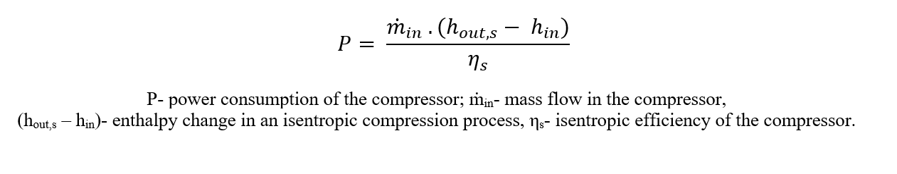

Initial Parametrization
========================

The `tutorial <https://tespy.readthedocs.io/en/main/tutorials/heat_pump_steps.html>`_
provided in TESPy’s documentation for simulating heat pumps
has been followed to develop the first design calculation, available in
the `‘Parametrization_NominalData.py’ <https://gitlab.com/mosaik/components/energy/
mosaik-heatpump/-/blob/10-improve-documentation/docs/code/scripts/Compressor_Param
etrization/Parametrization_NominalData.py?ref_type=heads>`_ file. While the tutorial
provides a detailed explanation of the complete parametrization of the model, only
the most relevant parameters are discussed here.

The data obtained from the manufacturer’s datasheet corresponding to the
nominal operating point is shown in table below.

.. table:: Nominal operating point data
   :align: center

   +----------------------------------------------+----------+------------+
   | **Parameter**                                | **Value**| **Units**  |
   +==============================================+==========+============+
   | Condenser inlet temperature                  | 30       | °C         |
   +----------------------------------------------+----------+------------+
   | Condenser outlet temperature                 | 35       | °C         |
   +----------------------------------------------+----------+------------+
   | Source air temperature                       | 7        | °C         |
   +----------------------------------------------+----------+------------+
   | Temperature difference for air in evaporator | 5        | °C         |
   +----------------------------------------------+----------+------------+
   | Heating capacity                             | 32.5     | kW         |
   +----------------------------------------------+----------+------------+
   | Electrical Power                             | 8.56     | kW         |
   +----------------------------------------------+----------+------------+
   | Refrigerant                                  | R448A    | --         |
   +----------------------------------------------+----------+------------+

This data has been used to set the parameters of the corresponding components
and connections as described in the tutorial. Since the refrigerant R448A is
not available in TESPy, R404A has been used due to the similarity in their
properties (`reference <https://doi.org/10.1016/j.enconman.2015.08.034>`_).

TESPy uses the isentropic efficiency of the compressor to calculate the power
consumption as shown in equation below.

Since the isentropic efficiency of the compressor (*'eta_s'*) is not available in the
datasheet, the value has been changed on a trial-and-error basis to
match the power consumption calculated by the model to that mentioned in
the datasheet.

.. literalinclude:: ../code/scripts/Compressor_Parametrization/Parametrization_NominalData.py
   :language: python
   :lines: 128-131
   :lineno-start: 128

.. note::

   For heat pumps having two stages of compression, like the one in this example, in addition
   to the isentropic efficiency, the pressure ratio (*'pr'*) for the second stage is also a
   required parameter.

   This has to be adjusted on a trial and error basis as well, so that it works for
   the different range of operating conditions of the heat pump. This could be checked, by choosing
   data points from the edges of the operation range, and following the same procedure as done for
   nominal operating point data.