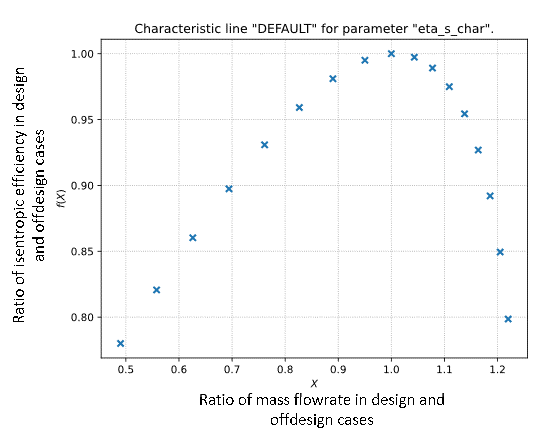
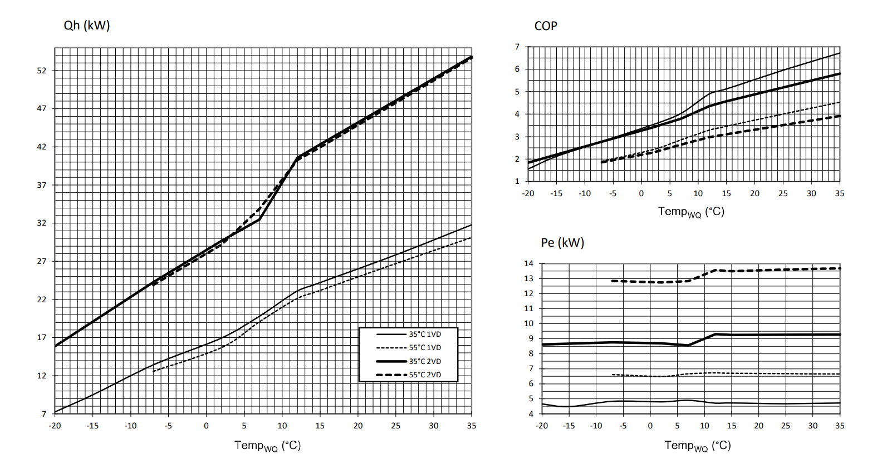
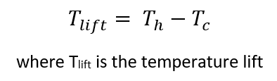
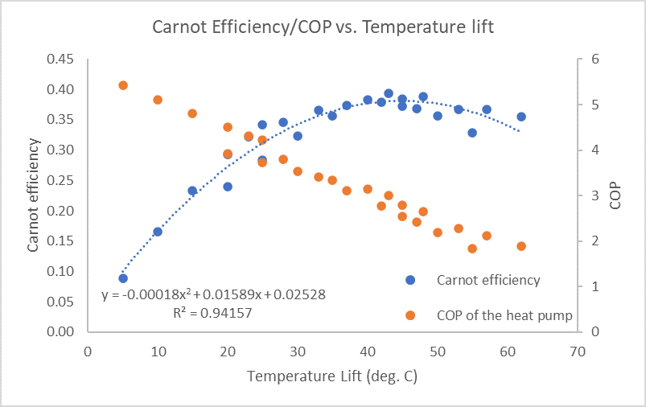
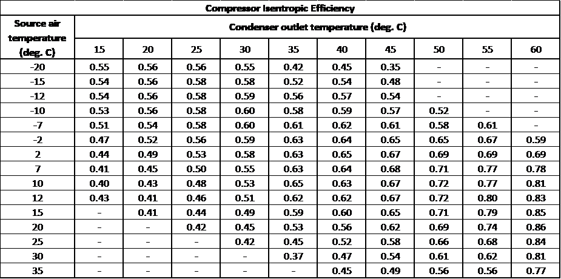

Compressor efficiency map
==========================

The design case from the previous step can be used as the basis for
*offdesign* calculations to predict the system’s performance (in terms
of Electrical power/COP) at different operating conditions, i.e., a
different source or consumer inlet temperature. While the tutorial in
TESPy’s documentation provides a detailed explanation of all the changes
between the two modes of calculations, only the most relevant changes
are discussed here.

The refrigerant and the temperature difference for air in the evaporator
remain unchanged. The source air temperature and the condenser inlet
temperature are available as inputs to the model. The maximum heating
capacity at a particular source air temperature is available from the
datasheet. The condenser outlet temperature is not known in the
off-design case, but must be predicted. In the design mode, the heating
capacity and temperature difference between condenser inlet and outlet
are used to calculate the mass flow in the circuit. This mass flow is
used to calculate the condenser outlet temperature in the off-design
mode.

In order to determine the electrical power consumption, the isentropic
efficiency of the compressor is required. Since this is not available in
the datasheets for the entire range of operation, the `default
characteristic curve <https://tespy.readthedocs.io/en/main/api/data.html#id6>`_
available in the TESPy library, shown in figure below, is used.

         the compressor in TESPy library
   :align: center
   :scale: 75

   Default characteristic curve for the isentropic efficiency of the
   compressor in TESPy library

The x-axis is the ratio of the mass flow into the
compressor in the design and off-design cases, and the y-axis is the
ratio of the isentropic efficiencies in the design and off-design
conditions.

The default characteristic curve is generic and therefore does not
accurately reflect the performance of the specific model of the heat
pump chosen. Instead of relying on the isentropic efficiency from a
single design point and the default characteristic curve across the
entire range of operation, a series of design points have been developed
based on the data available in the manufacturer’s datasheet for the
operating conditions shown in table 3.3.

.. table:: Design point conditions
   :align: center

   +-----------------------------+---------------------------------------------+
   | Source air                  | -20, -15, -12, -10, -7, -2, 2, 7, 10, 12,   |
   | temperatures (:sup:`0`\ C)  | 15, 20, 25, 30, 35                          |
   +-----------------------------+---------------------------------------------+
   | Condenser outlet            | 15, 20, 25, 30, 35, 40, 45, 50, 55          |
   | temperatures (:sup:`0`\ C)  |                                             |
   +-----------------------------+---------------------------------------------+

The operating range of the heat pump for the source air temperature is
-20\ :sup:`0`\ C to 35\ :sup:`0`\ C. The actual operation range of the
heat pump on the condenser outlet temperature is 25\ :sup:`0`\ C to
60\ :sup:`0`\ C. In the model, the range is further increased to
15\ :sup:`0`\ C to 60\ :sup:`0`\ C, in order to simulate low temperature
lift conditions. The temperature difference in the condenser, constant
at 5\ :sup:`0`\ C in the design case, has been used to calculate the
condenser inlet temperature.

Extension of the heating capacity table of the heat pump
--------------------------------------------------------
The manufacturer’s datasheets contain the heating power curves and the
electrical power curves as shown in figure below.

         heat pump
   :align: center
   :scale: 40

   Heating capacity, electrical power, and COP curves of the chosen
   heat pump

In all the plots, the x-axis corresponds to the source (air) temperature.
The data is available for the entire range of source air temperature, but
only for two condenser outlet temperatures, 35\ :sup:`0`\ C and 55\ :sup:`0`\ C.

The heating capacity increases with an increase in the source air
temperature, but does not change significantly with a change in the
condenser outlet temperature. At a given source air temperature, the
heating capacity for all the other condenser outlet temperatures is
assumed to be the average of the heating capacities at 35\ :sup:`0`\ C
and 55\ :sup:`0`\ C.

The power consumption changes with both the source air temperature and
the condenser outlet temperature. An approach based on Carnot efficiency
has been used to predict the power consumption at the condenser outlet
temperatures other than 35\ :sup:`0`\ C and 55\ :sup:`0`\ C. The ideal
COP is calculated for all the operating points, using the equation below.

   Equation for ideal COP

For the operating points where the power consumption/COP is known, the
Carnot efficiency has been calculated using the following equation.

   Equation for Carnot efficiency

The temperature lift for all the operating points is calculated using
equation below

   Equation for temperature lift

A second order polynomial equation has been fit to the pairs of the
Carnot efficiencies and the corresponding temperature lifts, of
operating points with condenser outlet temperatures 35\ :sup:`0`\ C and
55\ :sup:`0`\ C, as shown in figure below.

         heat pump
   :align: center
   :scale: 65

   Carnot efficiency/COP vs Temperature Lift plot for the chosen heat
   pump

In this figure, the COP of the heat pump is also plotted against the
temperature lift. The Carnot efficiencies of the remaining operating points
are estimated using the fit equation, which in turn are used to estimate
the real COP/power consumption.

For the series of design points identified, the calculated heating
capacity and power consumption data is summarized in the table below.

.. _expanded_heating_capacity_table:

   Expanded heating capacity table of the heat pump

The heating capacity data has to be saved in the `‘Heat_Load_Data.csv’
<https://gitlab.com/mosaik/components/energy/mosaik-heatpump/-/blob/10-imp
rove-documentation/docs/code/scripts/Compressor%20Parametrization/Data/Hea
t_Load_Data.csv?ref_type=heads>`_  file and the power consumption data has
to be saved in the `‘PI_Data.csv’ <https://gitlab.com/mosaik/components/
energy/mosaik-heatpump/-/blob/10-improve-documentation/docs/code/scripts/
Compressor_Parametrization/Data/PI_Data.csv?ref_type=heads>`_ file.

Generating the compressor efficiency map
----------------------------------------

The tutorial available in the `‘script_etas_gen.ipynb’ <https://gitlab.com/
mosaik/components/energy/mosaik-heatpump/-/blob/10-improve-documentation
/docs/code/scripts/Compressor_Parametrization/script_etas_gen.ipynb?ref_
type=heads>`_ is followed to generate the compressor efficiency map. The
model is parametrized for each of the design point in the expanded heating
capacity table from the previous step, as done for the initial parametrization
of the model for the nominal operating point. As the power consumption of the
compressor is dependent on the isentropic efficiency, which is set as a
parameter in the compressor, it is changed for each point in order to match
the power consumption calculated by the model and that in the table. The
isentropic efficiency values are restricted to the range of 0.25 - 0.95.
In the instances when the power values cannot be matched even at the
extreme values, they are assumed despite the difference in power
predicted by the model and that in the table. The compressor isentropic
efficiency map generated as described is summarized in table below.

.. _compressor_efficiency_table:

   Compressor isentropic efficiency map

