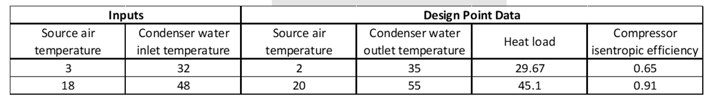
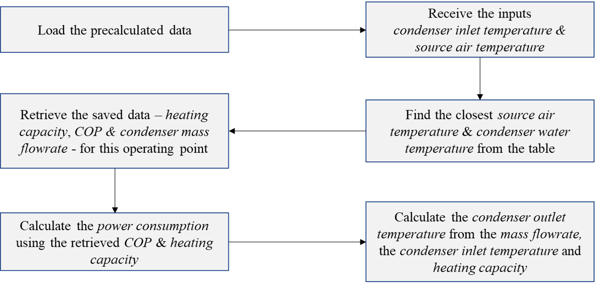

*'fast'* mode data
==================

*'detailed'* calculation mode of the model for the simulations
--------------------------------------------------------------

After establishing the series of design points, the model is then developed
to estimate the performance of the heat pump at any operating
point within its range. The heat pump is used as the primary heating
source for the hot water tank. The temperature of the water flow to the
heat pump from the hot water tank, and the source air temperature are
the required inputs.

The model checks if the conditions are within the operation range of the
heat pump and ensures that the source air temperature is lower than the
incoming water temperature. The source air temperature closest to the
input value is then identified from the :ref:`expanded heating capacity table
<expanded_heating_capacity_table>`.
The model checks that the inlet water temperature is lower than the maximum
possible condenser outlet temperature at the identified design source air
temperature. Assuming a temperature difference of 5\ :sup:`0`\ C in the
condenser in the design case, an initial condenser outlet temperature is
estimated. The closest design point to the estimated condenser outlet
temperature is then identified from the :ref:`extended heating capacity
table <expanded_heating_capacity_table>`.
In case this estimated condenser temperature is greater than the maximum
possible outlet temperature, the maximum value is used as the design point.
The heating capacity and the isentropic efficiency of the compressor
corresponding to the design point source air and condenser outlet water
temperatures are identified from the respective tables, the :ref:`expanded
heating capacity table <expanded_heating_capacity_table>` and :ref:`compressor
efficiency table <compressor_efficiency_table>`.

The model first performs a network calculation in the *design* mode at the
identified design point operating conditions. An *offdesign* mode
calculation of the network is then performed for the actual input
operating conditions, based on the design mode calculation and the
default characteristics of *TESPy*, to obtain the condenser outlet water
temperature (supply temperature), the mass flow of water in the
condenser and the power consumption of the heat pump.

   Example of detailed calculation mode

*'fast'* calculation mode of the model
--------------------------------------

In addition to the detailed mode of calculation explained above, a fast
calculation mode has also been implemented in the model to improve its
computational speed. The model is discreetly parametrized over the
entire operation range of the heat pump, at a resolution of
1\ :sup:`0`\ C for both the inputs, the source air temperature, and the
condenser water inlet temperature. The detailed calculation mode can be
implemented over this range of inputs and the output data from the
model- the coefficient of performance (COP) of the heat pump and the
condenser mass flow rate- can be saved. During the actual simulation, the
saved inputs that are lower/closest to the actual input data are
identified, and the saved output data for these points are used to
calculate the outputs of the model, rather than performing the actual
*design* and *offdesign* calculations. Though the granularity of the model
is reduced, there is a significant improvement in the simulation
duration.

         model
   :align: center
   :scale: 60

   Flowchart explaining the fast calculation mode of the TESPy heat pump
   model

Generation of *'fast'* mode data
--------------------------------

The data for the *'fast'* calculation mode can be calculated and saved as
follows:

1. **Adding the new heat pump model**

   The initial parametrization of the new heat pump model, based on
   the nominal operating point, from the `'Parametrization_NominalData.py’
   <https://gitlab.com/mosaik/components/energy/mosaik-heatpump/-/blob/10-
   improve-documentation/docs/code/scripts/Compressor_Parametrization/
   Parametrization_NominalData.py?ref_type=heads>`_ file, should be added
   to the *'_design_hp’* method of the `heat_pump_design.py <https:
   //gitlab.com/mosaik/components/energy/mosaik-heatpump/-/blob/10-improve
   -documentation/mosaik_heatpump/heatpump/Heat_Pump_Design.py?ref_type=heads>`_
   file (lines 212-232).

2. **'fast' calculation mode data generation**

   The tutorial in the `‘Fast_Calculation_Mode.ipynb’ <https://gitlab.com/
   mosaik/components/energy/mosaik-heatpump/-/blob/10-improve-documentation
   /docs/code/scripts/Fast_Calculation_Mode/Fast_Calculation_Mode.ipynb?ref_
   type=heads>`_, should be followed to generate the fast mode data.

3. **'fast' calculation mode data processing**

   The tutorial in the `‘Fast_Mode_DataProcessing.ipynb’ <https://gitlab.com/
   mosaik/components/energy/mosaik-heatpump/-/blob/10-improve-documentation
   /docs/code/scripts/Fast_Calculation_Mode/Fast_Mode_DataProcessing.ipynb?ref_
   type=heads>`_ script should be used to process the fast mode data, to fill
   the missing values in the data that result from the errors in the model etc.

Module Documentation
--------------------

.. automodule:: mosaik_heatpump.heatpump.Heat_Pump_Design
   :members:
