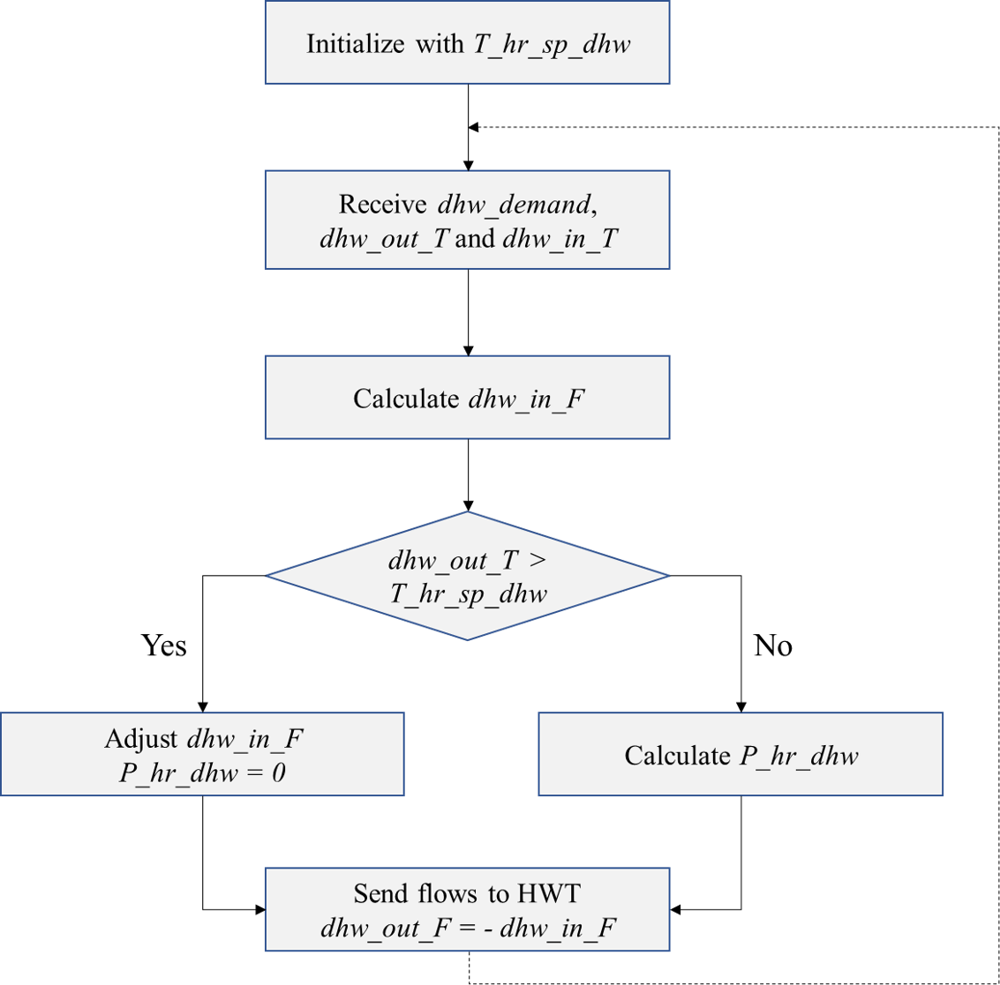
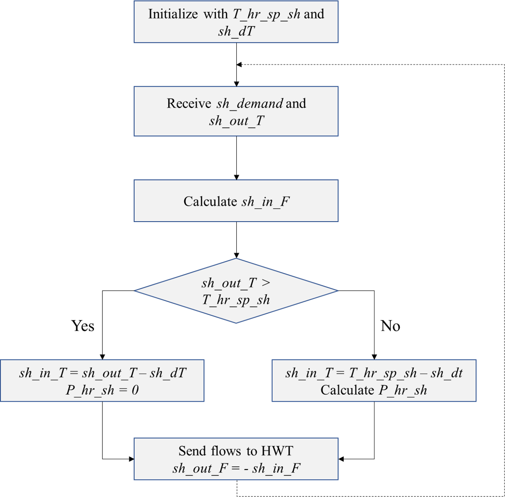
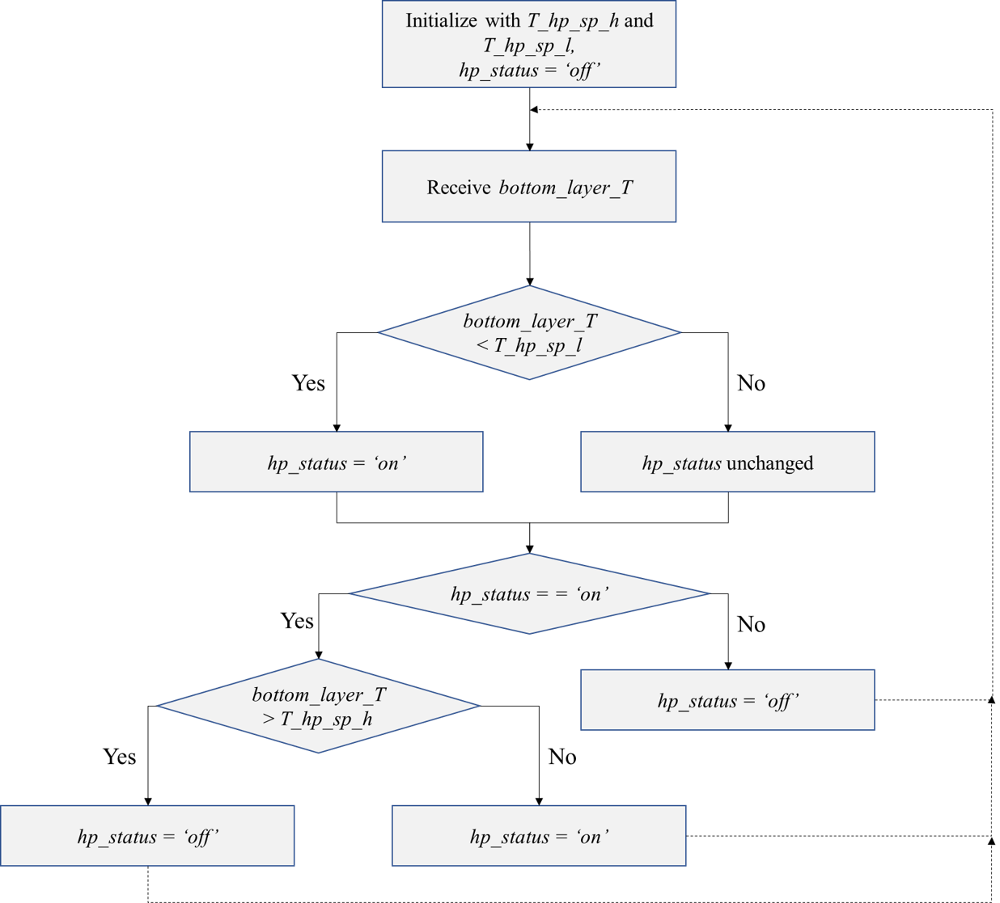
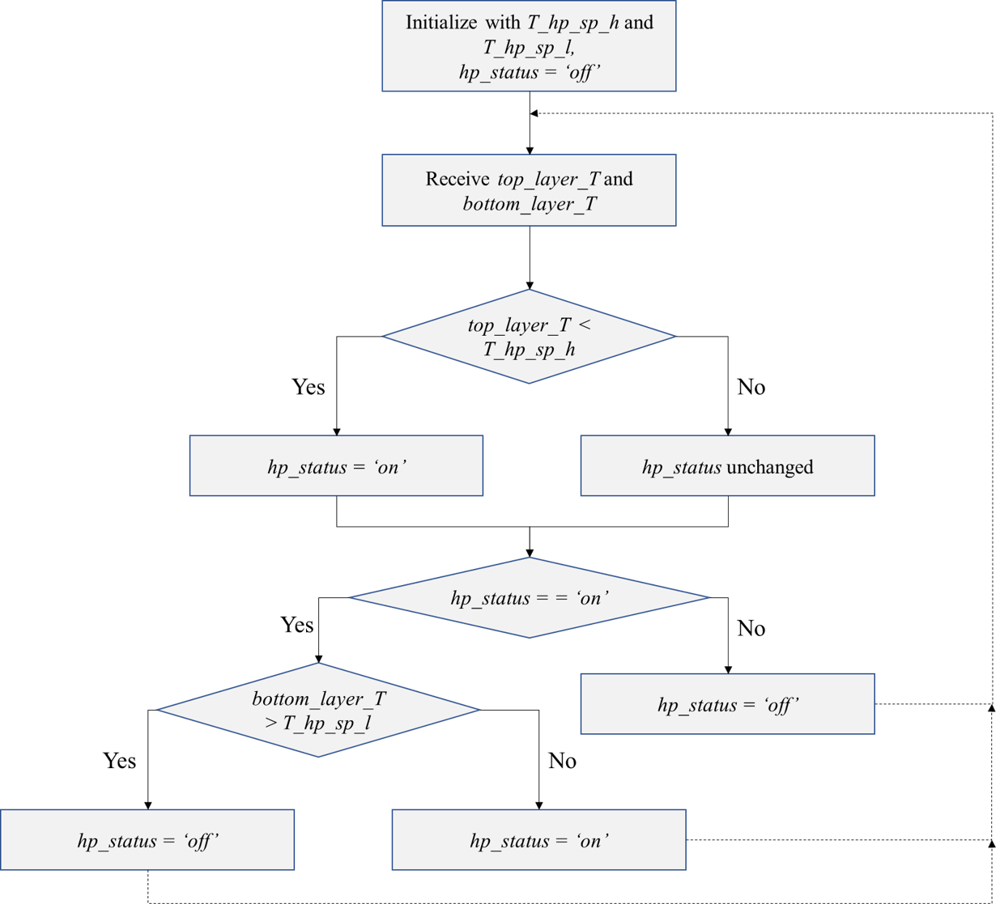

Controller
==========

The controller model used in this work utilizes simple Boolean logic to:

1. Match the heating demands with the supply from the hot water
   tank/back up heaters

2. Control the operation of the heat pump and adjust the mass flows in
   the heat pump circuit

3. Control the in-built heating rod in the hot water tank

In order to perform each of the above functions, the controller must be
initialized with a set of parameters. The controller then analyzes the
information received from the different models and sends the necessary
information back to the models for the progression of the simulation.
The specific parameters and the information exchange for each of the
functions are detailed below.

Domestic hot water demand
-------------------------

The controller is initialized with a set point for the domestic hot
water (DHW) supply temperature (*T_hr_sp_dhw*). For each time step of
the simulation, the controller receives the domestic hot water demand
(*dhw_demand*), in liters of water, the temperature of the water
available for supply from the hot water tank (*dhw_out_T*), and the
temperature of the cold inlet water (*dhw_in_T*). The controller then
calculates the flow rate of water to be supplied from the tank by
dividing the demand with the time step (*dhw_out_F*). If the water from
the tank is available for supply at a temperature greater than the set
point, flow is adjusted by mixing with the cold inlet water. If the
temperature of water from tank is lower than the set point, the
controller calculates the heat to be supplied by the backup heater to
achieve the set point temperature, which is also the electric power
required (*P_hr_dhw*) by the heater, assuming 100% efficiency. Finally,
the controller sets the information of the flows to the hot water tank
(*dhw_out_F, dhw_in_F*).

   Control flow for domestic hot water demand

Space heating demand
--------------------

The controller is initialized with the set points for the space heating
(SH) supply temperature (*T_hr_sp_sh*) and the temperature
difference in the space heating circuit (*sh_dT*). For each time step of
the simulation, the controller receives the space heating demand
(*sh_demand*), in kW, the temperature of the water available for supply
from the hot water tank (*sh_out_T*). The controller then calculates the
flow rate of water to be supplied from the tank from the demand and the
temperature difference (*sh_in_F*). If the water from the tank is
available for supply at a temperature greater than the set point, the
return temperature (*sh_in_T)* is calculated as the difference between
the supply temperature and the temperature difference. If the
temperature of water from tank is lower than the set point, the
controller calculates the heat to be supplied by the backup heater to
achieve the set point temperature, which is also the electric power
required (*P_hr_sh*) by the heater, assuming 100% efficiency. The
controller also calculates the return temperature as the difference
between the set point temperature and the temperature difference.
Finally, the controller sets the information of the flows to the hot
water tank (*sh_out_F, sh_in_F, sh_in_T*).

   Control flow for space heating demand

Heat pump operation -control strategy 1
---------------------------------------

A simple hysteresis control based on the temperature of the bottom layer
of the hot water tank has been implemented for the operation of the heat
pump. The controller is initialized with a higher (*T_hp_sp_h)* and
lower (*T_hp_sp_l)* temperature set point for the hot water tank. The
controller then receives the temperature of the bottom layer
(*bottom_layer_T*) of the hot water tank. The bottom layer of the tank
is controlled to be maintained in between the two temperature limits,
i.e., the heat pump is turned on when the temperature in the bottom
layer of the tank falls below the lower set point. The heat pump is
turned off only when the temperature in the bottom layer of the tank is
greater than the higher set point. The heat pump continues to remain
turned off and turns back on only when the temperature of the bottom
layer falls below the lower set point again. The heat pump is controlled
by setting its status (*hp_status*) to either ‘\ *on*\ ’ or ‘\ *off*\ ’
based on the control logic explained above. The heat demand from the
heat pump (*hp_demand*) is calculated to be sent to the heat pump.

   Control strategy 1, for the operation of heat pump

Heat pump operation -control strategy 2
---------------------------------------

In addition to the control strategy for the heat pump operation
explained earlier, which is based only on the temperature of the bottom
layer of the hot water tank, a control strategy based on the
temperatures of both the bottom and top layers of the tank has been
implemented. The controller is initialized with a higher (*T_hp_sp_h)*
and lower (*T_hp_sp_l)* temperature set point for the hot water tank, as
done in the first control strategy. The controller then receives the
temperatures of the top layer (*top_layer_T*) and the bottom layer
(*bottom_layer_T*) of the hot water tank. The top layer of the tank is
controlled against the higher set point, i.e., the heat pump is turned
on when the temperature in the top layer of the tank falls below the
higher set point. The bottom layer of the tank is controlled against the
lower set point, i.e., the heat pump is turned off only when the
temperature in the bottom layer of the tank is greater than the lower
set point. In this case, the temperature of the top layer is expected to
be greater than the higher set point due to stratification inside the
tank. The heat pump continues to remain turned off and turns back on
only when the temperature of the top layer falls below the higher set
point again. The heat pump is controlled by setting its status
(*hp_status*) to either ‘\ *on*\ ’ or ‘\ *off*\ ’ based on the control
logic explained above. The heat demand from the heat pump (*hp_demand*)
is calculated to be sent to the heat pump.

   Control strategy 2, for the operation of heat pump

Module Documentation
--------------------

.. automodule:: mosaik_components.hp_hwt_controller.controller
   :members:
