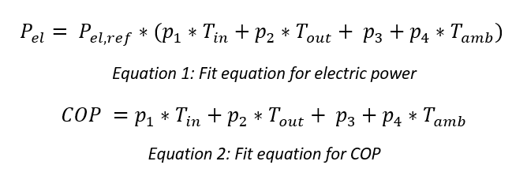

Heat pump
=========

The heat pump model comprises four different calculation modes for
simulating the performance of a heat pump - '*detailed*',
'*fast*', '*hplib*', and '*fixed*' modes. The first two are
based on the `TESPy library <https://github.com/oemof/tespy>`_,
the third is based on the `hplib
library <https://github.com/FZJ-IEK3-VSA/hplib>`_. In these three
modes, a quasi-steady state modelling approach has been adopted, i.e.,
the conditions of the operation of the heat pump vary with each
time-step and the steady state performance of the heat pump is
calculated at these different conditions for each time-step. The
'*fixed*' mode is the most simplified, operating the heat pump with
a fixed performance irrespective of the different operating conditions.

The model based on hplib, hereafter referred as "*hplib*" model, is a
parametric fit equation-based model, and thus takes a statistical
approach to predict the performance of the heat pump at different
operating conditions. The model based on TESPy, hereafter referred as
"*tespy*" model, is more complex and considers the physical states of
the fluids in the different components of the heat pump. Therefore, it
offers greater flexibility than the *hplib* model in estimating the
performance of the heat pump at different operating conditions.
However, as a result of this increased complexity, the simulation
time for the detailed calculations in *tespy* model is higher as compared
to that of the simpler calculations in *hplib* model.

*hplib* model
-------------

The *hplib* model is based on `hplib ("Heat Pump LIBrary")
<https://github.com/FZJ-IEK3-VSA/hplib>`_, an
open-source Python library that simulates the performance heat pumps
using parametric fit equations for the electric power and COP. The fit
parameters are identified by applying a least square regression model on
the publicly available heat pump `keymark data <https://keymark.eu/en/products/
heatpumps/certified-products>`_ of the European Heat Pump
Association (EHPA). It is possible to simulate the performance of both
air and water source heat pumps. The parameters are available for a
generic heat pump of both the types, as well as specific models
available in the market.

The limits on the operation of the heat pump, the supply water and
source air temperature ranges available from the technical datasheets of
the chosen heat pump model, have been added to the model directly
available in the hplib library.

The equations 1 and 2 are the fit equations for the electric power
and COP respectively. The reference values, P\ :sub:`el,ref` is the
electrical power consumption at -7\ :sup:`0`\ C source temperature and
52\ :sup:`0`\ C supply water temperature. In both the equations,
p\ :sub:`1-4` are the fit parameters, T\ :sub:`in` is the source inlet
temperature, T\ :sub:`out` is the supply water temperature, and
T\ :sub:`amb` is the ambient temperature.

The evaporator and condenser inlet temperatures are the inputs to the
model. The model checks if they are within the operating range and
ensures that the source air temperature is lower than the incoming water
temperature. The model then calculates the electric power, COP, the
heating capacity, and the condenser mass flow as outputs. The electric power and
COP are estimated as shown in equations 1 and 2
respectively. The heating capacity is calculated from the electric power
and COP. The mass flow in the condenser is calculated assuming a
temperature difference of 5\ :sup:`0`\ C.

How to use the *hplib* calculation mode
.......................................

The user must specify the ‘\ *calc_mode*\ ’ parameter as ‘\ *hplib*\ ’,
and the ‘\ *heat_source*\ ’, either ‘\ *air*\ ’ or ‘\ *water*\ ’, must
be specified. For the ‘\ *hp_model*\ ’ parameter, the user can choose
from the different heat pump models available in the public heatpump keymark
database (the keywords can be obtained from the
‘hplib_database.csv’ file). If the ‘\ *hp_model*\ ’ is set to
‘\ *Generic*\ ’, the user must additionally specify ‘\ *cons_T*\ ’,
‘\ *heat_source_T*\ ’, and ‘\ *P_th*\ ’.

The limits of operation for the heat pump are not available directly
within the model in the *hplib* library. If a corresponding equivalent
heat pump model based on TESPy is available, the keyword for that model
can be specified in the ‘\ *equivalent_hp_model*\ ’. If not, the
operation limits can be specified via ‘\ *hp_limits*\ ’ parameter.

An example of the dictionary with the required parameters can be seen in
the :ref:`module documentation <module_documentation_hp>`.

*tespy* model
-------------

The *tespy* model is based on `TESPy (“Thermal Engineering Systems in
Python”) <https://github.com/oemof/tespy>`_,
an open-source Python library that provides a powerful
simulation package for thermal processes like power plants, district
heating systems, heat pumps etc. An initial version of this model has
been used in a `previous work <https://doi.org/10.1186/s42162-021-00180-6>`_,
and significant changes have been made later for a master's thesis and for different
research projects. The performance of the heat pump is simulated by
considering the energy and mass balances in the individual
“\ *components*\ ” of the heat pump – condenser, evaporator, compressor,
expansion valve, heat exchangers and pumps – and the state of fluids in
the “\ *connections*\ ” between these “\ *components*.” The
*connections* and *components* together form a topological *network*
that is represented and solved as a system of equations. The schematic
of the heat pump system used in this work is shown in the figure below.

.. figure:: ../images/heatpump_2.png
   :alt: Schematic of the heat pump system network
   :align: center
   :scale: 65

   Schematic of the heat pump system network

The flexibility offered by the TESPy library in choosing the components
of the network has been implemented through the following features in the model:

**Stages of compression**

-  The heat pump model is available in two system configurations, either
   with a one-stage compressor or a two-stage compressor.

**Additional components**

-  Intercooler between the two stages of compression

-  Superheater between the evaporator and the compressor

TESPy has two modes of calculation, *design* and *offdesign*, to solve
the network. The *design* mode is used to design the system and forms
the first calculation of the network. While designing the plant, TESPy
offers much greater detail as compared to hplib, in terms of the
parametrization of the individual components, for example, the
isentropic efficiency of the compressor. The *offdesign* mode is used to
calculate the performance of the system if parameters deviate from the
design point, for example, operation at partial loads or operation at
different temperature/pressure levels. The system calculations from the
*design* mode form the basis for the *offdesign* mode. Both of these
calculation modes have been implemented in this model.

How to use the *tespy* based calculation modes
..............................................

The user must specify the ‘\ *calc_mode*\ ’ parameter as
‘\ *detailed*\ ’ or ‘\ *fast*\ ’. A detailed description of these two
modes of calculation can be found here :doc:`here <../advanced/step3>`.

The ‘\ *heat_source*\ ’, either ‘\ *air*\ ’ or ‘\ *water*\ ’, must be specified.

For the ‘\ *hp_model*\ ’ parameter, the user can choose from the different heat
pump models available, shown in the table below.

+--------------------------+------------------+---------------------------+
| **Heat pump model from   | **Keyword for    | **Configuration**         |
| market**                 | 'calc_mode'**    |                           |
+==========================+==================+===========================+
| `Daikin Altherma         | Air_6kW          | Stages of compression - 1 |
| ERLQ00                   |                  |                           |
| 6CV3 <https://www.manual |                  | Intercooler - No          |
| slib.com/manual/1100042/ |                  |                           |
| Daikin-Erlq-Cv3.html>`__ |                  | Superheater - No          |
+--------------------------+------------------+---------------------------+
| `Daikin Altherma         | Air_8kW          | Stages of compression - 1 |
| ERLQ00                   |                  |                           |
| 8CV3 <https://www.manual |                  | Intercooler - No          |
| slib.com/manual/1100042/ |                  |                           |
| Daikin-Erlq-Cv3.html>`__ |                  | Superheater - No          |
+--------------------------+------------------+---------------------------+
| `Daikin Altherma         | Air_16kW         | Stages of compression - 1 |
| ERLQ01                   |                  |                           |
| 6CV3 <https://www.manual |                  | Intercooler - No          |
| slib.com/manual/1100042/ |                  |                           |
| Daikin-Erlq-Cv3.html>`__ |                  | Superheater - No          |
+--------------------------+------------------+---------------------------+
| `ait-deutschland         | Air_30kW         | Stages of compression - 2 |
| LW-300(L                 |                  |                           |
| ) <https://www.alpha-inn |                  | Intercooler - No          |
| otec.ch/alpha-innotec/pr |                  |                           |
| odukte/waermepumpen/luft |                  | Superheater - No          |
| wasser/lw-300-l.html>`__ |                  |                           |
+--------------------------+------------------+---------------------------+
|                          | Air_30kW_1stage  | Stages of compression - 1 |
|                          |                  |                           |
|                          |                  | Intercooler - No          |
|                          |                  |                           |
|                          |                  | Superheater - No          |
+--------------------------+------------------+---------------------------+
| `Viessmann Vitocal       | Air_60kW         | Stages of compression - 2 |
| 300-A <https:/           |                  |                           |
| /www.heizungsdiscount24. |                  | Intercooler - Yes         |
| de/pdf/Viessmann-Waermep |                  |                           |
| umpe-Vitocal-300-A-AWO-P |                  | Superheater - Yes         |
| lanungsanleitung.pdf>`__ |                  |                           |
+--------------------------+------------------+---------------------------+

Any other heat pump available in the market, with a different heating
capacity and configuration, can be added to the model, following the
procedure shown in the :doc:`example <../advanced/index>` of the
“Air_30kW” heat pump.

.. note::

    With TESPy, it is possible to simulate the performance of water-water
    heat pumps as well. However, this has not yet been integrated into this
    model and will be a part of a later release.

Example
-------

An example scenario using the heat pump simulator in the mosaik
environment is available in the `'run_heatpump.py' <https://gitlab.com/mosaik/
components/energy/mosaik-heatpump/-/blob/10-improve-documentation/docs/code/
examples/run_heatpump.py?ref_type=heads>`_ file.

The simulation is configured as shown below. The inputs to the heat pump
model and the outputs from it are handled by *‘mosaik-csv’* .

.. literalinclude:: ../code/examples/run_heatpump.py
   :language: python
   :lines: 4-20
   :lineno-start: 4

The **tespy** model is used in the *'fast'* calculation mode. The *'Air_8kW'* heat pump is chosen. The
required parameters are set as shown below.

.. literalinclude:: ../code/examples/run_heatpump.py
   :language: python
   :lines: 22-30
   :lineno-start: 22

The timeseries of heat demand, heat source temperature, and the condenser water inlet
temperature, that are needed as inputs for the model, are available in the `'heatpump_
data.csv' <https://gitlab.com/mosaik/components/energy/mosaik-heatpump/-/blob/10-
improve-documentation/docs/code/examples/data/heatpump_data.csv?ref_type=heads>`_ file.

.. literalinclude:: ../code/examples/run_heatpump.py
   :language: python
   :lines: 32-37
   :lineno-start: 32

The output data is saved into ‘hp_trial.csv’ file.

.. literalinclude:: ../code/examples/run_heatpump.py
   :language: python
   :lines: 39-44
   :lineno-start: 39

The different entities are then connected and the simulation is executed.

.. literalinclude:: ../code/examples/run_heatpump.py
   :language: python
   :lines: 46-52
   :lineno-start: 46

.. _module_documentation_hp:

Module Documentation
--------------------

.. automodule:: mosaik_components.heatpump.Heat_Pump_Model

.. autoclass:: mosaik_components.heatpump.Heat_Pump_Model.Heat_Pump
   :members:

.. autoclass:: mosaik_components.heatpump.Heat_Pump_Model.Heat_Pump_Inputs
   :members:

.. autoclass:: mosaik_components.heatpump.Heat_Pump_Model.Heat_Pump_State
   :members:
