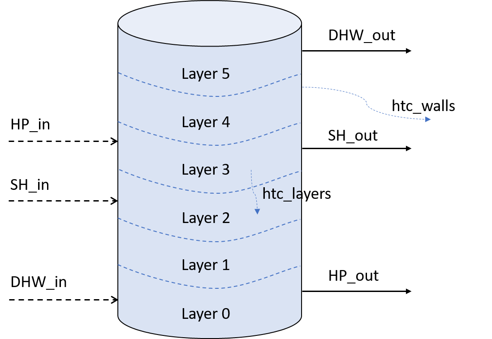

Hot water tank
==============

The hot water tank model developed for `another project <https://www.vde-
verlag.de/proceedings-de/454308056.html>`_, is used in
this work to act as a buffer in between the heating device and the heat
consumer. It is a `multinode stratified thermal tank model <https://doi.org/
10.1016/j.apenergy.2019.02.075>`_, where
the tank volume is divided into a specified number of layers (nodes) of
equal volume, each characterized by a specific temperature. A
traditional density distribution approach is adopted where the water
flowing into the tank enters the layer that best matches its density
(i.e., temperature). The model assumes that the fluid streams are fully
mixed before leaving each of the layers and the flows between the layers
follow the law of mass conservation. Heat transfer to the surrounding
environment from the walls of the tank, and the heat transfer between
the layers have been considered.

Parametrization of the model
----------------------------

The schematic of the hot water tank model is shown in figure 3.9. The
dimensions of the tank are specified in terms of its height, and either
the volume or diameter. The tank can be parametrized with sensors in the
model to record its temperature. The initial temperature of all the
layers must be set at the beginning of the simulation.

The flows into and out of the tank are specified as the connections of
the hot water tank model. The flow going to the heat pump (*HP_out*),
the space heating demand (*SH_out*), and the domestic hot water demand
(*DHW_out*) are connected to the bottom layer, the fourth layer and the
top layer respectively. As described above, the flows coming into the
tank are not connected to a fixed layer in the tank. They are connected
to the layer with a temperature closest to that of the flow.

|image1|

Figure .: Schematic representation of the hot water tank model (example
with 6 layers)

The heat transfer coefficient of the walls of the tank (*htc_walls*) is
assumed to be 0.28 W/m\ :sup:`2`-K . The heat transfer
coefficient for the heat transfer between the layers of the tank is
assumed to be 1.5 times the thermal conductivity of water.
The value is calculated as 0.897 W/m-K, considering the thermal
conductivity of water to be 0.598 W/m-K. However, these values can
be changed by modifying the parameters dictionary of the hot water tank
model.

Calculation of the model
------------------------

The initial temperature profile inside the tank can be specified at the
time of initialization of the model. For flows coming into the tank,
both the temperature and flow rate should be specified. For the flows
going out of the tank, only the flow rate should be specified, as the
temperature is obtained from the corresponding layer of the tank. The
model ensures that the overall flow into and out of the tank is equal.
The model then updates the temperatures of each layer based on the water
flows through the specified connections, the heat transfer between the
layers and the heat transfer to the surrounding environment. The model
has the functionality to flip the layers to ensure a negative
temperature gradient from the top to the bottom of the tank. Finally,
the model updates the connections with respect to the updated layer
temperatures. For the flows going out of the tank, the temperature is
updated. For the flows coming into the tank, the corresponding layer is
updated.

Example
-------

An example scenario using the hot water tank simulator in the mosaik
environment is available in the `'run_tank.py' <https://gitlab.com/mosaik/
components/energy/mosaik-heatpump/-/blob/10-improve-documentation/docs/code/
examples/run_tank.py?ref_type=heads>`_ file.

The simulation is configured as shown below. The inputs to the hot water tank
model are handled by *‘mosaik-csv’* and the outputs are handled by *‘mosaik-hdf5’*.

.. literalinclude:: ../code/examples/run_tank.py
   :language: python
   :lines: 7-22
   :lineno-start: 7

The hot water tank model has one inlet connection and one outlet connection. The
required parameters and the initial values are set as shown below.

.. literalinclude:: ../code/examples/run_tank.py
   :language: python
   :lines: 24-44
   :lineno-start: 24
   :emphasize-lines: 10-13

The mass flow and temperature timeseries for these connections, that are needed as
inputs for the model, are available in the `'tank_data.csv' <https://gitlab.com/mosaik
/components/energy/mosaik-heatpump/-/blob/10-improve-documentation/docs/code/examples/
data/tank_data.csv?ref_type=heads>`_ file.

.. literalinclude:: ../code/examples/run_tank.py
   :language: python
   :lines: 46-51
   :lineno-start: 46

The output data is saved into ‘hwt_trial_1.hdf5’ file.

.. literalinclude:: ../code/examples/run_tank.py
   :language: python
   :lines: 53-57
   :lineno-start: 53

The different entities are then connected and the simulation is executed.

.. literalinclude:: ../code/examples/run_tank.py
   :language: python
   :lines: 59-64
   :lineno-start: 59

